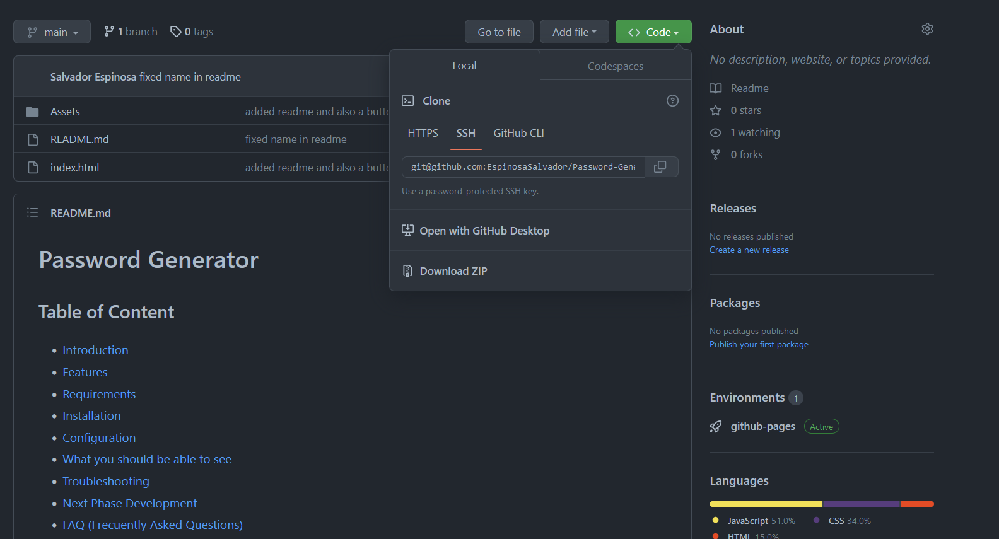
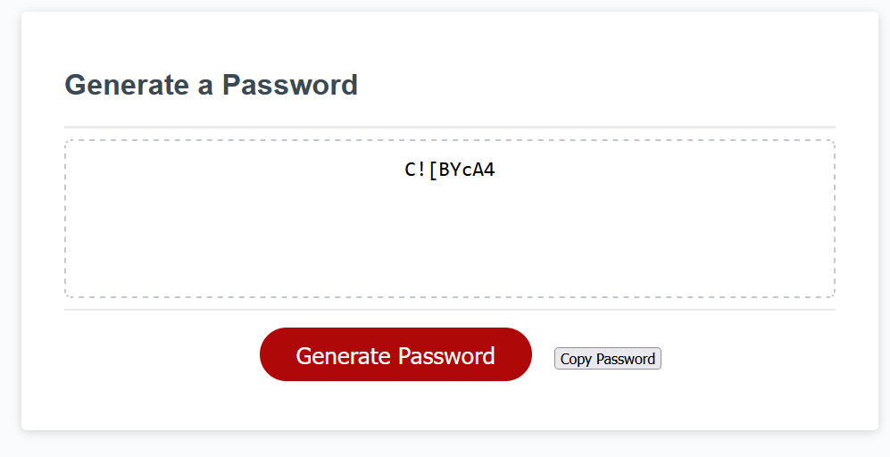

# Password Generator

## Table of Content

* [Introduction](#introduction)
* [Features](#features)
* [Requirements](#requirements)
* [Installation](#installation)
* [Configuration](#configuration)
* [What you should be able to see](#what-you-should-be-able-to-see)
* [Troubleshooting](#troubleshooting)
* [Next Phase Development](#next-phase-development)
* [FAQ (Frecuently Asked Questions)](#faq-frecuentrly-asked-questions)
* [Team](#team)

## Introduction

This app is designed to allow users to generate secure and randomized passwords. The app provides. various options for users to customize their passwords, including the length of the password and the type of characters that the password should include, such as uppercase and lowercase letters, numbers and special characters. 

The password generator app helps users to create strong and unique passwords thar are more difficult to guess or crack, which can improve their online security and protect their sensitive information.

## Features

* Allows the user to generate a password with a specific lenght.
* Includes options for the user to include uppercase and lowercase letters, numbers, and special characters in the password.
* Provides real-time feedback to the user as they change the options for the password.
* Includes a copy button to easily copy the generated password to the clipboard.
* Includes alerts that let the user know there is an error for when the user inputs an invalid password length or chooses no character types to include.

## Requirements

the requirements to run this webpage are really low due that we are only using *HTML*, *CSS* and *JS*.

* Vs code
* GitHub
* Internet
* Download JS to its latest release.

## Installation

To install this project please proceed to my [GitHub Repository](https://github.com/EspinosaSalvador/Password-Generator--Salvador-Espinosa-Valdez)

you should be able to see this,


Click on code as shown in the image



Copy the SSH key or the HTTPS key and open.

* Terminal
* Git bash
* CMD

either one of this will work. please proceed to the terminal an put in your Terminal,

```
git clone git@github.com:EspinosaSalvador/Password-Generator--Salvador-Espinosa-Valdez.git
```

and now you have a copy of the code.

## Configuration

If you want to do any configurations on this project please open a new branch you can do this by putting the following code in your terminal,

```
git checkout -b ＜new-branch＞
```

switch branches putting the following code on your terminal.

```
git checkout ＜branchname＞
```

If you want to show us your code and merge please open a pull request on [Github](https://github.com/EspinosaSalvador/Password-Generator--Salvador-Espinosa-Valdez/pulls).


## What you should be able to see

These is what you should be able to see in the Webpage,


Please proceed to click on Generate Password. an alert should pop up on your screen like this img


please continue with and click confirm or cancel

* OK = True or Yes

* Cancel = False or No 

this is the way the password should be seen the webpage.



Please use the button copy password to add a copy to your clipboard.

## Troubleshooting

The Password Generator is in version 1.0 ,please let me know if there are anybug in the webpage by issuing it in [Github](https://github.com/EspinosaSalvador/Password-Generator--Salvador-Espinosa-Valdez/issues)

## Next Phase Development

This are will be updated depending on the feedback from the users.

## FAQ (Frecuentrly Asked Questions)

We will update this part when we have some frequently asked question.

## Team

* Salvador Espinosa Valdez
